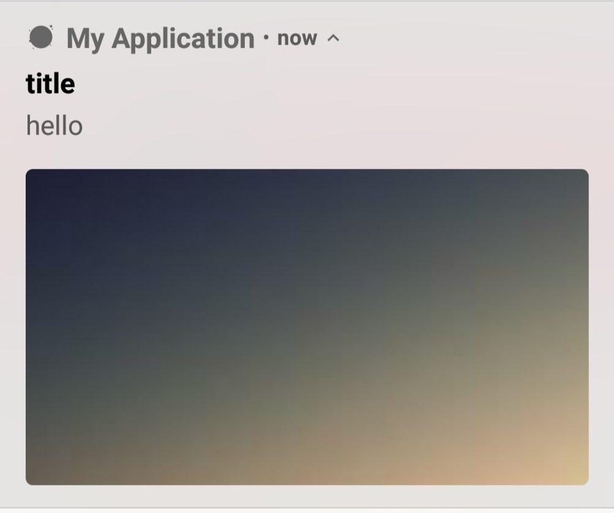
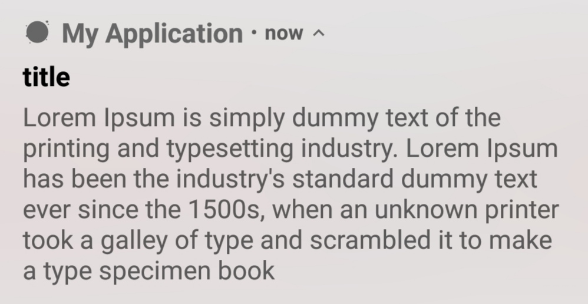
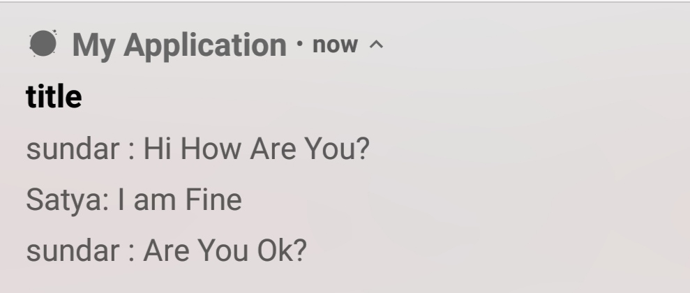

# Android-Sending-Push-Notifications-From-Server
## Follow the Steps:

 ### [1. Firebase Setup](https://firebase.google.com/docs/android/setup)
 ### [2. Create an API's](https://github.com/Dinesh2510/Android-Sending-Push-Notifications-From-Server/tree/master/Notification%20API's)

  
  
  
  
